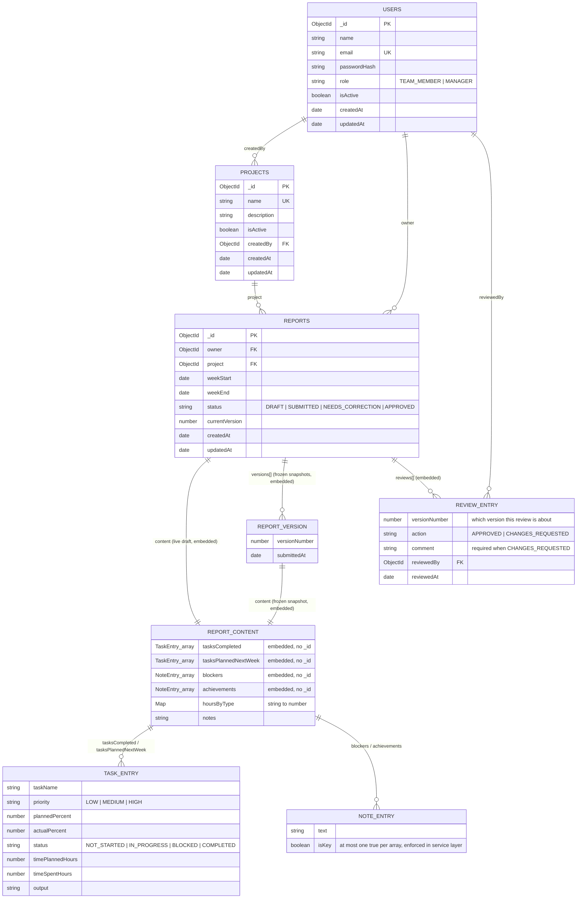

# ER Diagram — Weekly Report System

This is a MongoDB/Mongoose schema, not a relational database, so there are no
foreign key constraints at the database level. This diagram distinguishes
between two relationship types:

- **Reference relationships** (`owner`, `project`, `createdBy`, `reviewedBy`) — a
  `Types.ObjectId` stored on one document that points at another document in a
  *separate* collection, resolved at query time via `.populate()`.
- **Embedded relationships** (`content`, `versions`, `reviews`, and the shapes
  nested inside them) — sub-documents stored *directly inside* the parent
  document, with no separate collection or `_id` of their own (`{ _id: false }`
  schemas). These only exist as part of their parent and are never queried
  independently.

## Collections and embedded shapes

## Design notes (why embed vs. reference)

- **`content`/`versions`/`reviews` are embedded, not referenced.** A report's
  content is never queried or displayed independently of its parent report —
  there's no use case for "find all `NoteEntry` documents across all reports."
  Embedding keeps a full report (current draft + every past version + every
  review) retrievable in a single `findById`, with no joins.
- **`owner`, `project`, `createdBy`, `reviewedBy` are references**, because
  `User` and `Project` documents *are* independently queried (`GET /users`,
  `GET /projects`), have their own lifecycle (a project can be soft-deleted
  independently of any report that references it), and are shared across many
  reports — embedding a full user/project into every report would duplicate
  data and make renaming a project or updating a user's name require rewriting
  every report that references them.
- **`Report.content` vs. `Report.versions[].content`**: both use the exact
  same `ReportContentSchema`. `content` is the *live, editable draft* a team
  member works on while `DRAFT`/`NEEDS_CORRECTION`; each `versions[]` entry is
  an *immutable snapshot* of `content` taken at the moment of a submit. This
  is what makes the version-history requirement work — old snapshots are never
  mutated, only ever appended to.
- **The one-report-per-person-per-week rule** is enforced by a compound unique
  index on `reports`: `{ owner: 1, weekStart: 1 }`.
